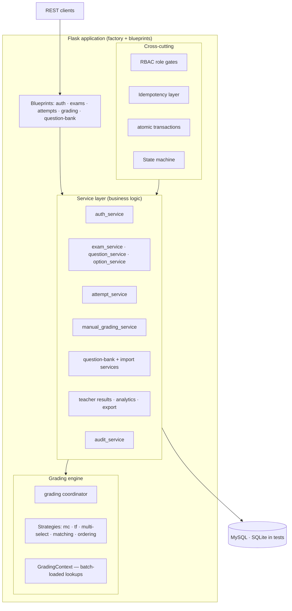
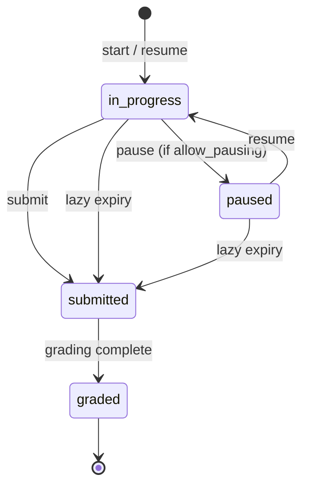

# Quizey

**A backend-heavy assessment & training platform — built to scale from "an exam can be taken and graded" toward a continuous, measurable learning loop.**

Exams are the mechanism. Continuous, measurable learning improvement is the product.

---

## About this repository

This is the **public project page** for Quizey. The source code lives in a private repository; this repository intentionally contains only this README. It documents the product vision, the architecture actually implemented, the engineering decisions behind it, and the current status — nothing more and nothing less.

---

## Table of contents

- [Product vision](#product-vision)
- [What Quizey provides today](#what-quizey-provides-today)
- [Backend architecture](#backend-architecture)
- [Domain model](#domain-model)
- [Assessment lifecycle](#assessment-lifecycle)
- [Grading engine](#grading-engine)
- [Teacher insight](#teacher-insight)
- [Student experience](#student-experience)
- [Reliability engineering](#reliability-engineering)
- [API surface](#api-surface)
- [Testing and engineering quality](#testing-and-engineering-quality)
- [AI-first direction](#ai-first-direction)
- [Production and infrastructure](#production-and-infrastructure)
- [Technology stack](#technology-stack)
- [Key engineering decisions](#key-engineering-decisions)
- [Current status and roadmap](#current-status-and-roadmap)

---

## Product vision

Quizey is designed around three users with three different goals:

| User | Who they are | Their actual goal |
|------|--------------|-------------------|
| **Creator** | Teacher, trainer, coach | Understand what learners know — not "create an exam" |
| **Learner** | Student, trainee, candidate | Know what to study next — not "get a high score" |
| **Organization** | School, company, training program | Understand group performance, not one individual |

Every assessment feeds a single loop:

```
Assess → Understand → Improve → Measure Again → Repeat
```

The assessment changes by context (school exam, coding interview, medical training, language learning); the loop stays the same. Quizey's job is to be the infrastructure for that loop, regardless of domain.

The long-term vision is **AI-first**: AI assists assessment authoring, grading with a human in the loop, and personalized recommendations. That direction shapes the architecture today, but it is deliberately **not built yet** — the current phase exists to make the underlying assessment engine and data trustworthy first. The rationale is explicit in the project plan: *AI without clean underlying data just hallucinates confidently.* (See [AI-first direction](#ai-first-direction).)

Product principles that drive engineering decisions:

1. **Every feature must improve learning** — it must trace back to Creator, Learner, or Organization value.
2. **Scores are not enough** — every score must produce actionable feedback.
3. **Every assessment creates data** — data creates insight; insight improves learning.
4. **AI never replaces the teacher** — every AI-assisted decision keeps a human in the loop until proven trustworthy.
5. **Every AI decision must be explainable** — never "the AI says so."

---

## What Quizey provides today

Quizey is a backend REST API. There is no frontend yet; the API is the product surface.

### Authentication & authorization
- Registration with role (`student` / `teacher`), email + password validation, password hashing.
- JWT access + refresh token pair; token refresh and logout (refresh-token blacklisting).
- Role-based access control enforced at the route layer, with the **database as the single source of truth** for a user's role (no JWT role claims).

### Exam & content management
- Exam creation, editing, listing, and retrieval with ownership enforcement (teachers manage only their exams).
- Question types: **multiple choice**, **true/false**, **multi-select**, **essay**, **matching**, **ordering**, **coding**, and **file upload** (file submission/storage deferred to infrastructure work).
- Publish validation per question type (option counts, correct-answer counts, rubric presence for manual-review questions).
- Scheduling windows, archiving, duplication, template cloning, version comparison, and rollback.
- **Version families via copy-on-write**: published exams are immutable; editing one creates a new draft version. Only one version per family is published at a time. Question options and full grading configuration — including rubrics — are deep-copied onto the new version.
- Question **soft-delete** (`deleted_at`) when student answers *or* an attempt paper reference the question, so grading and audit trails stay intact; hard delete when ungraded and unreferenced.
- Question locking on publish (`locked_at`) — no edits after publication.

### Question bank
- A reusable, teacher-owned question library with categories, tags, topics, difficulty levels, and Bloom's taxonomy levels, plus search and filtering.
- **Copy-on-attach semantics**: attaching bank content to an exam deep-copies it into an exam-local snapshot, so later bank edits can never mutate delivered exams, attempts, or grades.
- **Bounded CSV import** for MCQ-family and essay questions, with per-row validation reporting: valid rows commit, invalid rows are reported with line numbers, nothing fails silently.

### Assessment delivery
- **Attempt lifecycle**: start/resume, pause/resume, submit, lazy expiry, results.
- Attempts are **family-aware** — a student resumes the in-progress attempt anywhere in the exam's version family and new attempts target the newest published version.
- **Frozen attempt paper**: the question set *and* its order are selected and persisted exactly once, atomically with the attempt row at start. The paper is the source of truth for answer validation and grading; resume never recomputes or re-shuffles it. (Attempts created before this mechanism existed derive their paper from the exam version.)
- Configurable exam rules, enforced at start: `max_attempts` (across the whole version family), an availability window (`available_from` / `available_until`), and an optional `access_code`.
- **Seeded shuffle and question pools**: per-exam `shuffle_questions`, `shuffle_options`, and `pool_size` (draw a random subset of the question list). Selection and order are seeded per attempt, so a given attempt always resolves to the same paper; option order is a deterministic delivery-time permutation, and answers are graded by option identity — never by displayed position.
- Timing model: per-attempt active-time limit (`duration_minutes`, or untimed), an absolute wall-clock `deadline_at`, and per-exam pause policy (`allow_pausing`). Attempt telemetry records what actually happened (`started_at`, real `submitted_at`, paused time), separate from the configured rules.
- **Lazy expiration**: an attempt that runs out of active time or passes its wall-clock deadline is auto-finalized and graded on the next read/write. No background scheduler is required.

### Grading
- **Auto-grading** for multiple choice, true/false (all-or-nothing), matching (partial credit), and ordering (exact match).
- **Multi-select partial credit** with an exam-level numeric wrong-selection penalty.
- **Weighted questions** (`weight`) and **bonus questions** (`is_bonus`) with a defined, tested order of operations.
- **Manual grading** for essay and coding answers, driven by **rubrics**: a teacher-facing grading queue and a rubric-score grading endpoint.
- Per-question feedback in results (correctness, awarded points, and, for manual items, criterion scores).
- **Pass/fail verdicts**: an optional per-exam `passing_score` produces a pass/fail verdict that is persisted durably on the attempt record alongside the score.

### Integrity
- An **append-only audit log** (ORM guards + database triggers) recording key auth, publishing, versioning, grading, and submission events.
- **Exactly-once semantics** on mutating endpoints via an idempotency layer with a 24-hour retention window.
- All-or-nothing transactions via a nestable `atomic()` context manager.

---

## Backend architecture

Quizey is a **Flask modular monolith** following a strict layering rule:

```
Route → Service → Model → Database
```

Routes are thin: they parse input, enforce role gates, delegate to services, and return responses. Services contain all business logic and validation. Models define the schema. A grading **coordinator + strategy registry** provides a plugin-like extension point for question types; a shared batch-rescoring module lets teacher analytics and grade export reuse the exact same scoring functions.

```
app/
├── auth/          # Blueprint: register, login, refresh, logout, profile
├── exams/         # Blueprint: exam/question/option CRUD, publish, versioning,
│                  #   teacher results/analytics/export, student discovery
├── attempts/      # Blueprint: attempt lifecycle routes + student history
├── grading/       # Blueprint + grading coordinator + question-type strategies
├── question_bank/ # Blueprint: bank CRUD + CSV import routes
├── models/        # SQLAlchemy models (see Domain model)
├── services/      # Business logic: one module per domain above
├── extensions/    # Flask extension instances (db, jwt, migrate)
├── config/        # Environment-based configuration (development / testing / production)
└── utils/         # Cross-cutting: RBAC, idempotency, transactions, response helpers
```

### Architecture overview



Key structural properties:

- **Application factory** (`create_app`) with environment-driven configuration and a `/health` endpoint.
- **Blueprints per domain**, each registered under `/api/v1/...`.
- **No business logic in routes** — services are the only place domain rules live, and they are unit-tested independently of HTTP.
- **A grading engine with two layers**: a coordinator that owns scoring rules and a registry of per-question-type strategies. Strategies are **N+1-free by design** — the coordinator batch-loads every lookup a strategy might need into a `GradingContext`, and strategies never issue database queries. Teacher analytics and grade export reuse these same scoring functions through a shared batch module, so reported numbers cannot drift from grading.
- **Teacher and student visibility are explicitly separated** — teacher inspection and student result paths share domain logic but never share an authorization boundary. Per-exam review policies build on this separation.
- **Cross-cutting concerns are utilities, not layers**: RBAC decorators, an idempotency decorator, a nestable transaction context manager, and a reusable state-machine mixin.

---

## Domain model

16 tables, versioned through Alembic migrations.

```
users ──< exams ──< questions ──< options
  │         │  ^        │
  │         │  └─ root_exam_id (self-referential → version family)
  │         │
  │         └──< attempts (state machine) ──< answers ──< answer_options (multi-select)
  │                  │  │                        │
  │                  │  └──< attempt_questions   ├──< answer_evaluations ──< evaluation_criterion_scores
  │                  │       (frozen paper)      │
  │                  │                           └──< grade_overrides (append-only correction trail)
  │                  │
  │                  └── (timing telemetry: started_at, submitted_at, paused_at, total_paused_seconds)
  │
  ├──< idempotency_keys
  ├──< audit_logs (immutable)
  └──< token_blocklist

questions ──< rubrics ──< rubric_criteria      (grading contract for a question)
```

| Table | Purpose |
|-------|---------|
| `users` | Accounts with role (`student` / `teacher`); email/username unique |
| `exams` | Assessment config: title, lifecycle status, version number, `review_policy`, `max_attempts`, timing/access rules, assessment rules (shuffle, pools, passing score), `multi_select_penalty`, `exam_type`, `root_exam_id` (version family) |
| `questions` | Question text, 8-value `question_type`, `points`, `weight`, `is_bonus`, `requires_manual_review`, `type_config` (new types), bank/taxonomy columns, `locked_at`, `deleted_at` (soft delete), copy lineage |
| `options` | Answer options with `is_correct` flag |
| `attempts` | One row per attempt: `status` (state machine), timing telemetry, durable `score` / `passed` |
| `answers` | One row per (attempt, question) — unique constraint; single-select via `selected_option_id`, free-text via `text`, structured payloads via `response_json` |
| `answer_options` | Join rows for multi-select selections (unique per answer+option) |
| `attempt_questions` | The frozen per-attempt question paper: one row per selected question, position-ordered, written once inside the start-attempt transaction |
| `grade_overrides` | Append-only grade-correction history (old score, new score, reason, grader, timestamp) |
| `rubrics` | Grader-agnostic grading contract for a question (one-to-one) |
| `rubric_criteria` | Evaluation axes with `label`, `max_points` (fractional), `position` |
| `answer_evaluations` | Durable per-answer grading result (grader-agnostic `mechanism`); `pending` vs `graded` |
| `evaluation_criterion_scores` | Per-criterion awarded points + snapshots of the criterion definition |
| `idempotency_keys` | Enforces exactly-once semantics with a 24h TTL |
| `audit_logs` | Immutable, append-only record of sensitive actions |
| `token_blocklist` | Revoked refresh-token `jti` values |

### Notable design properties

- **Version families via `root_exam_id`** (self-referential foreign key). A family is the root plus every exam whose `root_exam_id` points at it. Attempt limits are enforced across the family; in-progress attempts stay frozen to the version they started.
- **Copy-on-write versioning.** Published exams are immutable. Editing one deep-copies questions, options (including correctness), and grading configuration (weight, bonus flag, manual-review flag, and rubric + criteria) into a new draft version. The old version remains live and gradable while the new draft is edited. Rollback restores content into a new version; versions can be listed and compared.
- **An attempt's paper is frozen at start.** Question selection, pools, and shuffle are computed exactly once — inside the transaction that creates the attempt — and persisted as that attempt's paper. A new exam version gets a fresh paper for *new* attempts; an in-progress attempt keeps the paper it started with.
- **Grading results are snapshotted, not recomputed.** `evaluation_criterion_scores` stores the criterion label / max points / position at grade time, so a grade remains historically reproducible even if the rubric later evolves. Rubrics themselves ride on exam versioning (published content is immutable).
- **Pending is not zero.** A manual answer awaiting review has `total_awarded = NULL` and is never presented as a numeric score. An attempt stays `SUBMITTED` until every manual evaluation is graded. A student is never shown a wrong intermediate score.
- **Soft delete only where audit matters.** Questions with student answers (or frozen-paper references) are soft-deleted; ungraded questions are hard-deleted. Exams have no soft-delete column — archiving is a lifecycle state.
- **Review policy is version config.** Each exam version carries its own `review_policy`; copies inherit it, and a historical attempt is always read against the policy of the version it was taken on.

---

## Assessment lifecycle

Attempt statuses are enforced by a **state machine** (`StateMachineMixin`) at the ORM level — assigning an illegal status raises `InvalidTransitionError` before anything hits the database. `GRADED` is terminal.



Lifecycle rules worth calling out:

- **Resume resumes the same paper.** The question set and its order are persisted at start, so a returning student is always handed exactly the paper they began — regardless of exam edits or rule changes since.
- **Resume over restart.** A student with an `in_progress` or `paused` attempt anywhere in the family resumes it (after an expiry check) rather than starting a new one. Availability-window and access-code gates apply only to *new* starts — a frozen attempt is exempt.
- **Lazy expiry, no scheduler.** On any read/write, an attempt whose active time is exhausted or whose wall-clock deadline has passed is atomically finalized (`submitted_at = now`) and graded in the same transaction. An expired attempt can never be resurrected.
- **Pause stops the active clock, not the wall clock.** `total_paused_seconds` accumulates paused intervals; a configured `deadline_at` keeps advancing while paused.
- **Double submission is provably impossible.** Submission requires the `in_progress` status, is re-checked inside the transaction, and the route is idempotent — a retried request cannot double-grade, and a second submit after grading returns 409.
- **Manual review blocks finalization.** Grading a submitted attempt with any pending manual answer keeps it `SUBMITTED`; the final pending manual evaluation transitions it to `GRADED`.

### Timing model

Assessment configuration lives on the exam; attempt telemetry lives on the attempt:

- **`Exam.duration_minutes`** — active-time limit (`NULL` = untimed).
- **`Exam.deadline_at`** — absolute wall-clock cutoff (`NULL` = none).
- **`Attempt.started_at` / `submitted_at`** — `submitted_at` is always the *real* finalization timestamp, never the configured deadline.
- **`Attempt.paused_at` / `total_paused_seconds`** — drive derived `total_elapsed_seconds` and `active_time_seconds`.

Effective remaining time is the smaller of active-duration remaining and wall-clock remaining; `NULL` for a fully untimed attempt; `0` once expired.

---

## Grading engine

Grading is split into two responsibilities:

1. **Strategies** (one per auto-gradable type) produce a *neutral* verdict — exact-match correctness plus, for multi-select, raw counts. They never award points and never query the database.
2. The **coordinator** owns all scoring rules and applies them in a fixed, documented order.

### Per-question scoring pipeline

```
raw performance
  → base / partial score        (all-or-nothing, or multi-select partial credit)
  → multi-select penalty        (exam-level, floored at 0, multi-select only)
  → weight multiplier           (effective = base × weight)
  → bonus constraint            (contribution clamped ≥ 0)
  → exam aggregation
```

### Grading features implemented

| Feature | Behavior |
|---------|----------|
| **Multiple choice / true/false** | All-or-nothing: `points` if correct, else `0`. |
| **Multi-select partial credit** | `fraction = max(0, selected_correct − selected_wrong × penalty) / total_correct`, clamped to `[0, 1]`; awarded as `points × fraction`. The penalty is an **exam-level numeric policy** (`multi_select_penalty`, default `0.0` = no deduction). A `0` penalty is valid and triggers an advisory warning, never a rejection. |
| **Matching** | Automatic grading with partial credit (`correct_pairs / total_pairs`); target reuse disabled, unanswered pairs score zero. |
| **Ordering** | Automatic grading, exact match only. |
| **Weighted questions** | `effective_points = points × weight` (weight > 0, default `1.0`); applies to normal and bonus questions. |
| **Bonus questions** | Excluded from the normal denominator; earned points are *added* to the score; a bonus can never reduce a score (contribution clamped ≥ 0). Percentage is intentionally **not capped at 100** — a perfect normal score plus earned bonus can exceed 100%. |
| **Manual grading (essay, coding)** | Open-ended answers are graded against a rubric. Rubric scores are normalized onto the question's points (`rubric_fraction = total_awarded / Σ max_points`), then weight/bonus rules apply unchanged. |
| **Per-answer evaluation** | One durable `AnswerEvaluation` per answer (`answer_id` UNIQUE), grader-agnostic via a `mechanism` field (`manual` today; `ai` reserved). Criterion scores are snapshotted for historical reproducibility. |

### Manual grading flow

1. A question marked `requires_manual_review` accepts free-text (or code) answers instead of option selections.
2. On submit, a durable `pending` evaluation is created — the attempt stays `SUBMITTED`.
3. The teacher pulls the manual-grading queue (oldest-submitted first, teacher-owned exams only).
4. The teacher posts per-criterion `awarded_points` (0 ≤ awarded ≤ max, fractional allowed) to the grading endpoint. The server derives the total, validates every criterion (missing / unknown / duplicate / out-of-range → 422), persists evaluation + snapshots, and re-grades the attempt **in one transaction**. The grade route is idempotent.
5. Grading the final pending answer transitions the attempt to `GRADED`.

Unanswered manual questions score `0` (never "pending"). Rubric regrades update the authoritative evaluation, and an append-only **grade-override** history records every correction (old score, new score, reason, grader, timestamp). Teachers can view the full correction history for any answer, and grade corrections always preserve the audit trail — the current grade and its history are never conflated.

---

## Teacher insight

After publication, teachers get a complete read/analysis/egress layer over the assessment data — version-pinned throughout:

- **Result inspection.** List attempts for an owned exam version and read one complete historical attempt result, with standard ownership checks. Reads follow the attempt's frozen paper (soft-deleted snapshots included), so later versions, rollbacks, and bank edits never move history.
- **Live analytics.** Per-exam aggregates (totals, completed/pending counts, average score, pass rate, score distribution) plus per-question performance (average awarded vs. available points), computed live in SQL with batched rescoring — `scope=version` by default, `scope=family` only on explicit request. Pending manual work is counted but never averaged. No caching, no background jobs.
- **Streamed grade export.** A generator-based CSV download rendering the analytics layer's numbers through the same scoring implementation — never a second scoring system.
- **Teacher/student visibility is explicitly separated**: shared domain logic, but teacher reads and student reads never share an authorization boundary. Exam review policies build on this separation.

---

## Student experience

Students go from discovery to graded, reviewable result with nothing out-of-band:

- **Exam discovery.** A student-only listing of every published exam with honest window state (`upcoming` / `open` / `closed`, same predicates as the start gate) and access-code presence as a boolean. Codes, questions, and teacher internals never leave the server.
- **Attempt history.** A student-only, cross-exam union of the student's attempts — each keeping its exact historical exam/version identity — with a status summary and a database-level bounded limit.
- **Review-gated results.** Each exam carries a `review_policy` (`always` / `after_close` / `never`, default `always`): answer-key feedback (correctness, selections, submitted payloads, rubric detail — across all eight question types) is withheld until the policy allows, while the **score always stays visible**. Historical attempts read their own version's policy, so later edits can never rewrite the past.

---

## Reliability engineering

Beyond CRUD, the project invests in correctness and auditability:

- **Idempotency.** The `@idempotent` decorator (client-supplied `Idempotency-Key` header) gives exactly-once semantics for answer submission, attempt submission, and manual grading. A unique (user, key, endpoint) constraint means concurrent retries resolve to a single winner; responses are replayed from storage for 24h; stale in-progress locks are cleaned by a CLI command.
- **Atomic transactions.** The `atomic()` context manager is nestable — only the outermost call commits/rolls back — so multi-step operations (e.g., submit + grade + audit) commit or fail as a unit.
- **State-machine enforcement.** Illegal status transitions raise at the ORM level, not just at the service layer.
- **Immutable audit log.** `audit_logs` rows cannot be updated or deleted: SQLAlchemy `before_update`/`before_delete` listeners raise, and database triggers reject even raw-SQL writes. Wired for auth (login/logout), publishing, versioning, attempt submission, manual grading, and grade corrections.
- **Batch-loaded grading.** The coordinator loads options and selections in a fixed number of queries; strategies never cause N+1 queries.
- **Ownership + role checks.** Every mutating route enforces exam ownership *and* role (teacher for authoring/grading, student for attempts); read paths enforce the same ownership conventions.

---

## API surface

All endpoints live under a versioned prefix (`/api/v1/...`). At a glance, the surface covers:

| Area | What it exposes |
|------|-----------------|
| **Auth** | Registration (student/teacher), login → JWT pair, token refresh, logout (revocation), current-user profile |
| **Exams & content** | Exam CRUD and publishing with per-question-type validation; scheduling windows and archiving; question and option management; explicit version creation, version listing, version comparison, rollback, duplication, template cloning; per-exam assessment-rule read/update (copy-on-write on published exams) |
| **Question bank** | Bank CRUD with taxonomy and search/filter; attach-to-exam as snapshots; bounded CSV import with per-row reporting |
| **Teacher reads** | Version-pinned attempt list and single-result inspection; live analytics (`version`/`family` scope); streamed grade CSV export |
| **Student reads** | Published-exam discovery; cross-exam attempt history; review-gated results |
| **Attempts** | Start (or resume), frozen question-paper delivery, per-question answering, pause/resume, submit, attempt detail, graded result with per-question feedback |
| **Grading** | Teacher-facing manual-grading queue and rubric-score grading; grade corrections with an append-only history per answer |
| **Health** | Liveness check |

---

## Testing and engineering quality

The test suite is the project's primary quality gate, run as part of every milestone — **1116 tests passing, 0 errors** (+181 subtests), verified against real MySQL 8.0.46 (SQLite suite plus the MySQL-only migration module executing inside the run).

- **Organization:**
  - `tests/factories/` — factory functions for users, exams, questions, options, attempts, answers.
  - `tests/scenarios/` — reusable end-to-end scenario builders (full exam-taking flow).
  - `tests/concurrency.py` — a `threading.Barrier`-based harness that fires the same call simultaneously and asserts exactly-one-winner outcomes (e.g., 10 concurrent submits → exactly 1 graded).
  - `tests/base.py` — shared `BaseTestCase` wiring the app factory, in-memory DB, and teardown.
- **Major coverage areas** (verified collection counts per area):

| Area | What it pins down |
|------|-------------------|
| **Auth** (34) | Registration validation, login, refresh, logout/blacklist, profile |
| **RBAC** (20) | Role gates at decorator and route level, cross-role refusals |
| **Attempt lifecycle incl. history** (121) | Start/resume, pause/resume, lazy expiry, double-submit protection, frozen papers, cross-exam history, review gating |
| **Grading** (117) | Multi-select matrix, manual pending-vs-zero semantics, rubric normalization, queue, corrections history, pass/fail verdicts, weight/bonus order |
| **Exams incl. bank, teacher & student reads** (637) | CRUD, publish validation, copy-on-write versioning, compare/rollback, bank + CSV import, results/analytics/export, discovery, scheduling, rules |
| **Models** (112) | Per-model constraints, relationships, soft delete, state machine |
| **Idempotency** (11) · **Transactions** (7) · **Audit** (31) | Exactly-once replay, nestable all-or-nothing semantics, append-only enforcement at ORM and trigger level |

The suite includes regression tests for bugs found during manual QA and for historical-robustness guarantees (rollback/bank-edit/soft-delete invariance, version-pinned reads, N+1 elimination).

---

## AI-first direction

**Current AI implementation: none.** There is no LLM integration, no agent framework, no retrieval, no embeddings, no AI grading — and no `agents/` module. Phase 2 was deliberately AI-free: it exists to build the assessment engine, the reliability layer, and clean structured data that future AI can safely operate on.

What *does* exist today is an **AI-ready design** — architectural choices made so AI can plug in without rework:

- **Grader-agnostic evaluations.** `AnswerEvaluation.mechanism` is `"manual"` today and reserves `"ai"` for a future grading agent; the persisted result shape is identical either way.
- **Rubrics as grading contracts.** A rubric defines *how a question should be evaluated* independent of who (or what) evaluates. An AI grading agent can consume the same contract a teacher uses today.
- **Question taxonomy and attempt history.** Difficulty levels, Bloom levels, topics, frozen papers, and per-question awards give future models grounded features instead of raw text.
- **An audit log built for explainability.** Every future AI decision is expected to record its reasoning — the append-only audit infrastructure exists to support that.

Planned AI stages (Phase 3, not built):

- **3.1 AI-assisted assessment authoring** — question generation from source material, difficulty estimation, quality checks (teacher-in-the-loop; nothing auto-publishes).
- **3.2 Intelligent evaluation** — AI-assisted essay/coding grading against rubrics, confidence scores, a judge-critic pattern with human approval below a confidence threshold.
- **3.3 Personalized learning** — a per-student knowledge model fed by attempt history, driving weak-concept detection and personalized practice.
- **3.4 Agent platform** — multiple purpose-built agents (Exam Reviewer, Learning Coach, Teacher Assistant, Analytics Agent) with defined tools and memory, rather than a general-purpose chatbot.
- **3.5 AI engineering** — prompt versioning, evaluation pipelines, groundedness/hallucination detection, latency and cost tracking, and human-approval workflows.

The architecture intentionally sequences this: the data model (attempts, grades, rubrics, audit) is being built *before* the AI, so the AI layer stands on clean, trustworthy data.

---

## Production and infrastructure

**What exists today:**

- Environment-based configuration (`development` / `testing` / `production`) loaded from `.env`, with production refusing to boot on placeholder secrets.
- MySQL for development (PyMySQL driver); in-memory SQLite for tests.
- Versioned Alembic migrations (linear chain, single head) with a MySQL-only verification module.
- A `/health` liveness endpoint.
- A CLI command for idempotency-key cleanup.

**Deliberately not yet integrated** (planned, not present in the codebase):

- No containerization (Docker / Docker Compose).
- No CI/CD pipeline (GitHub Actions) and no deployment to any cloud (AWS, Kubernetes, etc.).
- No background job queue (Redis / Celery) — expiry is handled lazily by design.
- No object storage, search engine, caching layer, or metrics/observability stack.

This is a **backend engineering project in active development**; production hardening (containerization, CI/CD, monitoring, backups) is an explicit upcoming stage of the roadmap rather than a present capability. No part of this README should be read as claiming production readiness.

---

## Technology stack

Only technologies actually present in the codebase:

| Layer | Technology |
|-------|------------|
| Language | Python 3.10 |
| Web framework | Flask 3.x |
| ORM | SQLAlchemy 2.x (Flask-SQLAlchemy) |
| Migrations | Alembic (Flask-Migrate) |
| Auth | Flask-JWT-Extended (JWT access + refresh, HS256) |
| Password hashing | Werkzeug |
| Email validation | `email-validator` |
| Database (dev) | MySQL (PyMySQL) |
| Database (tests) | SQLite in-memory |
| Config | `python-dotenv`, environment-based |
| Testing | `pytest` (unittest-style suites, factories, scenarios, concurrency harness) |

---

## Key engineering decisions

The decisions below are the ones that most shape the system — each is documented in the project's engineering handbook and pinned by tests.

1. **Copy-on-write version families.** Published exams are immutable; edits create a new draft version linked through a self-referential `root_exam_id`. This gives free, consistent "exam version X" snapshots — attempts stay frozen to the version they started, grades stay reproducible, and the old version stays live while a new one is drafted.
2. **Assessment config vs. attempt telemetry.** What an exam *allows* (duration, deadline, pause policy, availability) lives on `Exam`; what an attempt *actually did* (started, real submitted time, paused time) lives on `Attempt`. `submitted_at` is always the real finalization timestamp. This split keeps rules changeable without corrupting historical records.
3. **A state machine enforced at the ORM level.** `StateMachineMixin` validates every status assignment via SQLAlchemy `@validates` — illegal transitions fail regardless of code path. Combined with an idempotent submit route and an in-transaction status re-check, double submission is provably impossible.
4. **Lazy expiration over a scheduler.** No background worker is needed to enforce time limits: any read/write path checks expiry and atomically finalizes+grades expired attempts. Simpler to deploy, and correct for the current single-service topology.
5. **A grading engine with a strategy registry.** Question types are pluggable behind a shared verdict contract, and the coordinator owns all scoring rules. Adding a question type means adding a strategy — not editing an `if/elif` chain.
6. **N+1-free grading by construction.** The coordinator batch-loads options and selections into a `GradingContext`; strategies cannot query the database. Grading a large attempt runs in a small, fixed number of queries.
7. **Explicit scoring semantics.** Weight, bonus, and multi-select penalty each have a documented order of operations and invariants (bonus contribution ≥ 0, percentage not capped, penalty floored at 0). Ambiguity here silently corrupts scores, so every rule is pinned by tests.
8. **"Pending is not zero."** An unanswered-review manual grade is represented as `NULL`, never as a numeric 0, and the attempt stays `SUBMITTED` until every manual evaluation is graded. A student is never shown a wrong intermediate score.
9. **Grader-agnostic evaluations with snapshot history.** Evaluations carry a `mechanism` (manual today, AI reserved) and per-criterion snapshots of the rubric definition — grades remain explainable and reproducible even if rubrics change later.
10. **Immutable audit log with defense in depth.** ORM-level event guards *and* database triggers prevent tampering, so audit integrity survives raw SQL access.
11. **Exactly-once semantics via an idempotency layer.** Client keys + a unique DB constraint + 24h response replay make retry-sensitive endpoints (answer submission, attempt submission, manual grading) safe under network retries and double-clicks.
12. **Modular monolith with a strict layering rule.** Routes are thin, services hold business logic, models define schema. This keeps the codebase navigable and testable as it grows.
13. **The frozen attempt paper.** Question selection (pools, shuffle) is computed exactly once — inside the transaction that creates the attempt — and persisted as that attempt's paper, which is the source of truth for answering and grading. Resume, re-delivery, and grading all read the same immutable rows, so no code path can hand a student a different paper than the one their answers are graded against.
14. **An append-only correction trail for grades.** Human grade corrections never rewrite history: each override appends a row (old score, new score, reason, grader, timestamp), while the evaluation remains the authoritative current grade — the same "current state + immutable history" split used for rubric snapshots.
15. **Teacher/student visibility is explicitly separated.** Shared domain logic, separate authorization paths: teacher reads are owner-scoped, student reads are self-scoped, and the two never share a serializer as a boundary. Exam review policies (`always`/`after_close`/`never`) build on this separation — gating answer-key feedback while the score always stays visible.
16. **Copy-on-attach question bank.** Bank rows and exam snapshots are different rows by design, so editing the library can never rewrite delivered content, attempt history, or grades. Bulk import reuses the exact single-creation validators per row.

---

## Current status and roadmap

**Status: core assessment backend complete through Stage 2.5**, verified by 1116 passing tests (0 errors) against real MySQL 8.0.46.

### Phase 1 — Foundation ✅ Complete
Authentication, exam/question/option management, publish + versioning, attempts, auto-grading, and the full test suite.

### Phase 2 — Production assessment platform ✅ Complete through 2.5

| Stage | Status |
|-------|--------|
| **2.1 Assessment platform** | ✅ Complete — attempt lifecycle, advanced grading (strategies, partial credit, weight/bonus, rubrics, manual queue, grade corrections, pass/fail verdicts), assessment rules, audit log |
| **2.2 Publishing & version management** | ✅ Complete — lifecycle states, scheduling windows, archiving, version families, comparison, rollback, duplication, templates, activity history |
| **2.3 Question bank** | ✅ Complete — reusable library with taxonomy and search, eight question types, copy-on-attach snapshots |
| **2.4 Instructor experience** | ✅ Complete — version-pinned result inspection, live analytics, streamed grade export, bounded bank CSV import |
| **2.5 Student experience** | ✅ Complete — exam discovery, cross-exam attempt history, review-policy result gating |
| **2.6 Platform services** | ⬜ Not started — background jobs, storage/caching/search, security hardening |
| **2.7 DevOps & production** | ⬜ Not started — containerization, CI/CD, monitoring, backups |

### Phase 3 — AI-native learning platform 🔷 Planned
AI-assisted authoring, intelligent grading with human-in-the-loop, personalized learning, a multi-agent platform, and the AI engineering layer (prompt versioning, evaluation, observability). See [AI-first direction](#ai-first-direction) for detail. No Phase 3 code exists yet.

---

*Assess → Understand → Improve → Measure Again → Repeat.*
